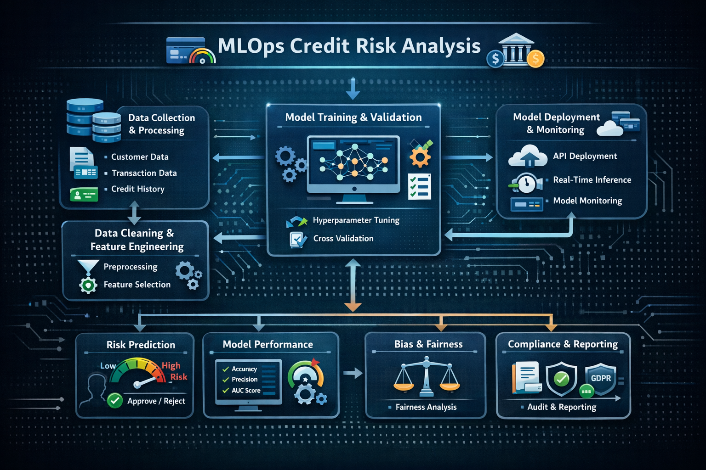

# Pipeline MLOps para Análisis de Crédito

Este proyecto implementa un flujo completo de **MLOps** para el análisis de riesgo crediticio, abarcando todas las etapas desde la exploración inicial de los datos hasta el monitoreo del modelo en producción.

---

## 📌 Objetivo
Predecir el riesgo crediticio de nuevos solicitantes mediante un pipeline robusto y escalable de MLOps.

---

## 1. Entendimiento del Negocio y los Datos
- **Definición del objetivo:** predecir el riesgo crediticio de nuevos solicitantes.  
- **Fuentes de datos:** historial financiero, comportamiento de pago, variables demográficas y transaccionales.  
- **Evaluación:** análisis de calidad y consistencia de los datos.  

---

## 2. ETL (Extracción, Transformación y Carga)
- **Extracción:** recopilación de datos desde múltiples fuentes (bases SQL, APIs, archivos CSV).  
- **Transformación:** limpieza, imputación de valores faltantes, codificación de variables categóricas, normalización y generación de nuevas características.  
- **Carga:** almacenamiento de los datos procesados en un repositorio estructurado listo para modelado.  

---

## 3. Entrenamiento y Validación del Modelo
- **Selección de algoritmos:** árboles de decisión, random forest, XGBoost, redes neuronales.  
- **División del dataset:** entrenamiento, validación y prueba.  
- **Optimización:** ajuste de hiperparámetros y evaluación con métricas como AUC, precisión y recall.  
- **Registro:** experimentos y versiones del modelo mediante herramientas MLOps (MLflow, DVC).  

---

## 4. Despliegue del Modelo
- **Implementación:** modelo expuesto como servicio API o microservicio.  
- **Integración:** conexión con aplicación web para solicitudes de evaluación crediticia.  
- **Automatización:** control de versiones y despliegue automatizado mediante CI/CD.  

---

## 5. Monitoreo y Retroalimentación
- **Seguimiento:** registro de solicitudes procesadas por la aplicación.  
- **Evaluación:** comparación del score generado por el modelo con resultados reales.  
- **Mantenimiento:** detección de drift y reentrenamiento automático si el rendimiento cae por debajo del umbral definido.  

---

## 📖 English Version: MLOps Pipeline for Credit Risk Analysis

This project implements a complete **MLOps workflow** for credit risk analysis, covering all stages from data exploration to production monitoring.

### 1. Business and Data Understanding
- **Goal:** predict credit risk for new applicants.  
- **Data sources:** financial history, payment behavior, demographic and transactional variables.  
- **Assessment:** evaluate data quality and consistency.  

### 2. ETL (Extract, Transform, Load)
- **Extract:** collect data from SQL databases, APIs, and CSV files.  
- **Transform:** clean, impute missing values, encode categorical variables, normalize, and create new features.  
- **Load:** store processed data in a structured repository ready for modeling.  

### 3. Model Training and Validation
- **Algorithms:** decision trees, random forest, XGBoost, neural networks.  
- **Dataset split:** training, validation, and test sets.  
- **Optimization:** hyperparameter tuning and evaluation using AUC, precision, and recall.  
- **Tracking:** experiments and model versions with MLflow, DVC.  

### 4. Model Deployment
- **Deployment:** expose the model as an API or microservice.  
- **Integration:** connect with a web application for credit evaluation requests.  
- **Automation:** manage versioning and automate deployment via CI/CD pipelines.  

### 5. Monitoring and Feedback
- **Tracking:** monitor requests processed by the application.  
- **Evaluation:** log model scores and compare with real outcomes.  
- **Maintenance:** detect drift and trigger retraining when performance drops below threshold.  

---

## 👤 Autor
**Sergio Masso**

## 🎯 Objetivo
Implementar un pipeline MLOps robusto y escalable para análisis de riesgo crediticio.